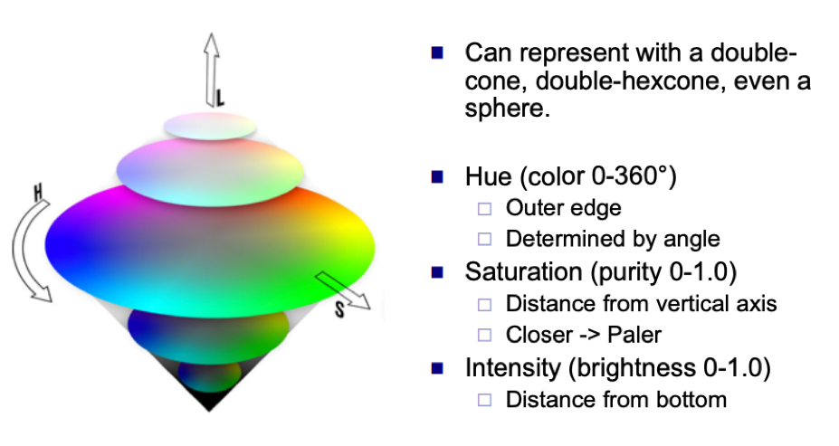

정확히 어떤 프로젝트를 진행하는 것인지 점심시간 이후에 서류를 전달받았는데,
생각했던거와 달라서, 최근에 읽던 논문은 보류하고 서류에 있는 대로 일단 진행을 해보려 합니다.

## IHS

[RGB to IHS](http://web.pdx.edu/~jduh/courses/Archive/geog481w07/Students/Welch_HSI-RGB-presentation.pdf)

**Intensity(Brightness) + Hue(Color) + Saturation(Purity)**

## VDSR code 

사용하는 Data의 model 문제이므로, 일단 train에서 Data가 Load되는 부분의 코드를 더 자세히 뜯어보았다.

### main_vdsr.py

train_set = DatasetFromHdf5("data/train.h5")
training_data_loader = DataLoader(dataset=train_set, num_workers=opt.threads, batch_size=opt.batchSize, shuffle=True)

 generate_train.m code로 만든 train.h5 dataset을 불러오는 형태이고, 
scale factor에 따라 data를 downsize 시켜 dataset을 만든다. 
이 코드에서 RGB, YCbCr등 color space 정보는 보이지 않는다. 

generate_test_mat.m code를 보면 Set5 folder 내 data들을 가지고 모든 데이터들에 대하여 ground truth file(rgb)을 ycbcr로 변경한다. 이후 Set5-mat folder안에 정보가 들어간다.

im_gt_ycbcr = rgb2ycbcr(im_gt / 255.0);
im_gt_y = im_gt_ycbcr(:,:,1) * 255.0;
im_l_ycbcr = imresize(im_gt_ycbcr,1/scale(s),'bicubic');
im_b_ycbcr = imresize(im_l_ycbcr,scale(s),'bicubic');
im_l_y = im_l_ycbcr(:,:,1) * 255.0;
im_l = ycbcr2rgb(im_l_ycbcr) * 255.0;
im_b_y = im_b_ycbcr(:,:,1) * 255.0;
im_b = ycbcr2rgb(im_b_ycbcr) * 255.0;
last = length(filepaths(i).name)-4;

이 코드들은 지금 Matlab 함수를 사용하여 rgb to ycbcr, ycbcr to rgb를 행한다.
이 부분의 data 형태를 원하는 color space로 변경하고, IHS에서 I성분을 YCbCr의 Y성분처럼 사용하면 될 것 같다.

## HDF5
- 매우 복잡한 데이터 객체 및 다양한 메타 데이터를 나타낼 수있는 다용도 데이터 모델
- 컬렉션의 데이터 개체 수나 크기에 제한이없는 완전히 이식 가능한 파일 형식
- 랩톱에서 대규모 병렬 시스템에 이르는 다양한 컴퓨팅 플랫폼에서 실행되는 소프트웨어 라이브러리이며 C, C ++, Fortran 90 및 Java 인터페이스를 사용하여 고급 API를 구현
- 액세스 시간 및 스토리지 공간 최적화를 가능하게함
- 컬렉션의 데이터를 관리, 조작,보기 및 분석하기위한 도구 및 응용 프로그램.

