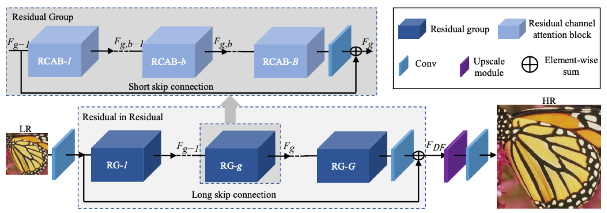
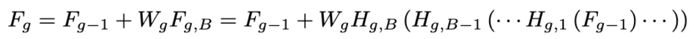
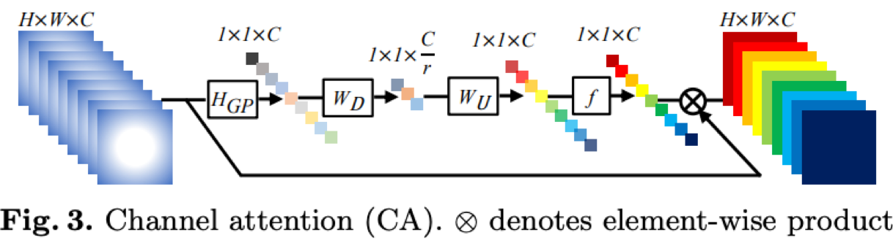
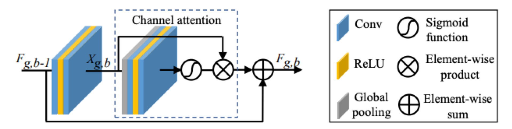
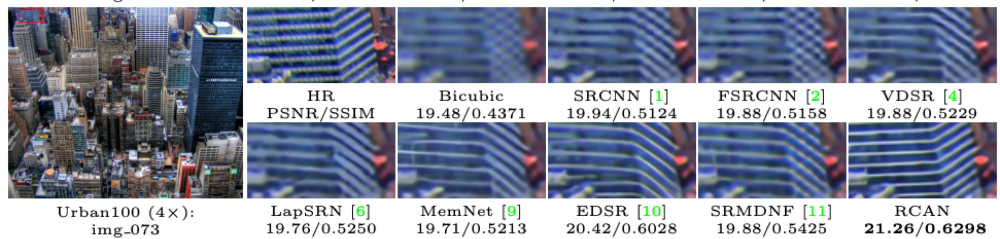

# Image Super-Resolution Using Very Deep Residual Channel Attention Networks (RCAN)

CNN의 깊이는 SR에 있어서 매우 중요하지만, 네트워크가 깊어질수록 훈련이 어려워진다. 저해상도의 입력들은 low-frequency 정보를 가지고 있고, 
이는 channel을 통과하면 동일하게 다루어지기 때문에, CNN의 표현력을 방해한다. 이 문제를 해결하기 위해, residual 구조 및 attention 네트워크를 사용한다.

residual structure를 사용함으로서, 저주피수 정보를 우회하고, 네트워크가 고주파수 정보를 학습하는 데에 중점을 둔다.
attention mechanism을 사용함으로서, 채널 간 상호 의존성을 고려하여 채널별 특성을 적용적으로 재조정 한다.

이 논문(RCAN)은 이전 연구들보다 높은 정확성과 시각적 개선을 달성하였다.

## Introduction

ill-posed problem인 SR문제를 어떻게 효과적으로 해결할 것인가? 
1. CNN을 사용한 SRCNN
2. Deep한 구조를 갖는 VDSR, DRCN
3. Residual Learning 도입 ( low resolution image는 deep한 구조를 가질수록 가지는 데이터 값들이 무의미하다. high resolution 정보를 사용하자 ! )
4. very wide한 EDSR, very deep한 MDSR -> 좋은 성능을 보임으로서, SR에 깊이가 매우 중요함을 알림.

하지만, 더 깊은 네트워크를 구성하기 위해 residual block을 쌓는 것 만으로는 더 좋은 결과를 낼 수 없다.
따라서 더 깊은 네트워크가 SR에 기여를 하는지, 어떻게 학습 가능한 deep한 구조를 train할 것인지는 탐구되어야 한다.
또한 최근의 CNN기반 방법은 channel별 기능을 동등하게 취급하기 때문에, 다양한 유형의 정보( 저주파수 및 고주파수 정보 )를 처리할 수 있는 유연성이 부족하다.
즉 결국 불필요한 계산을 하며, feature channel에서 차별적인 학습 능력을 결여시키고, 결국 깊은 네트워크의 표현력을 방해한다.

- 이 문제들을 해결하기 위해, Residual Channel Attention Network(RCAN)를 제안한다.
- 깊은 네트워크 훈련을 위해 residual in residual 구조(residual group이 기본 모듈로 사용되고, log skip connection이 residual learning을 사용) 제안
- 각 residual group에서 short skip connection(SSC)을 사용하여 몇개의 단순화된 residual block을 쌓는다.
- 채널간 상호 의존성을 모델링하는 channel attention mechanism 제안 ( 유용한 channel에 집중하고, 차별 학습 능력을 향상시킴 )

## Related Work

1. Deep CNN for SR
- SRCNN, VDSR, DRCN, DRRN( recursive blocks ), MemNet( memory block ) : 이 방법들은 LR을 원하는 크기로 interpolation해야하고, 이는 세부사항을 잃어버리고 계산을 크게 증가시킨다.
- FSRCNN, SRResNet, SRGAN
- EDSR, MDSR

2. Attention mechanism
- input의 요소 정보를 가장 잘 나타낼 수 있도록 하는 guidance
- 고추파 channel별 특징은 HR 재구성에 보다 많은 정보 제공

## RCAN
### Network architecture

- 크게 4가지 부분으로 구성된다. (  I(LR) : RCAN의 input,  I(SR) : RCAN의 output )
1. shallow feature extraction : shallow feature F(0) 추출 위해 오직 하나의 convolution layer 사용
2. deep feature extraction by residual in residual (RIR) : F(0)사용하여 진행, 결과물 F(DF)
3. upscale module : F(DF)를 upscale하여 f(UP)를 만든다. (up scale module : deconvolution, nearest-neighbor upsampling + convolution, ESPCN 방법 존재)
4. reconstruction part : F(UP)을 하나의 convolution layer를 통해 reconstruction한다.   

- loss function : L2, L1, perceptual, adversarial loss 중 L1 사용
- optimizer : sgd

### Residual in Residual (RIR)
- RIR 구조 : G residual group (각각의 RG : short skip connection 갖는 channel attention blocks-RCAB 포함) + long skip connection

- 400개 층 이상의 매우 깊은 CNN을 고성능으로 훈련시킴
- 여러 residual block을 쌓아 1000 layer 이상을 훈련시킬 수 있으나, 이런 방식으로 구축된 네트워크는 train에 어려움을 겪고 성능 향상을 달성하기 어렵다.

- 단순히 많은 RG(residual group)을 쌓는 것이 좋지 않음을 알고, 이를 해결하기 위해 long skip connection(LSC) 을 RIR에 추가하여, 매우 깊은 네트워크의 학습을 안정화한다.
- 또한 LSC는 RIR의 꼬리 부분에 있는 conv layer에 설정된 가중치를 사용하여 residual learning을 진행하며 더 나은 성능을 보인다.
- 풍부한 저주파수 정보는, identity 기반 skip connection을 통해 우회될 수 있다.
- 잔여학습에 대한 추가 단계를 만들기 위해, 각 residual group에 B residual channel attention block을 쌓는다.

- g+1번째 output은 g번째 input에 g번째 residual group을 씌운 것이다. (b는 RCAB)
- main network가 특정 feature에 더 집중할 수 있도록, short skip connection (SSC)를 사용하기도 한다. (W : weight of F)

- LSC와 SSC로 의하여 더 많은 저주파수 정보가 training 과정에 포함될 수 있다.

### Channel Attention (CA)
- 이전의 CNN기반 SR은 LR의 channel-wise feature를 동등하게 다루었지만, 실제로는 융통성이 없다.
- 보다 유익한 기능에 초점을 맞추기 위해 Channel Attention(CA)을 사용한다.

- 각각의 채널에 주의를 기울이는 것이중요하다. 
- 이 때 , 문제점
    1. Low-frequenct data가 더 복잡하게 보일 수 있다.
    2.  Convolution 후의 출력은 외부 context정보를 이용할 수 없다.

- average pooling : channel wise global spatial info to channel descriptor

### Residual Channel Attention Block (RCAB)
- residual group과 LSC는 네트워크가 LR의 더 중요한 정보에 집중할 수 있도록 해준다. 
- Channel Attention은 channel의 통계를 추출하여 네트워크의 차별성을 더욱 강화한다.
- RB에 CA에 통합한 RCAB를 제안

R L channel attention
conv layer kernel 3*3

## Experimentis

## Conclusion

- Very Deep Residual Channel Attention
- RIR : LSC, SSC로  깊게 도달할 수 있게함, 다수의 skip connection을 통해 풍부한 저주파수 정보 우회하여 고주파수 정보 학습을 도움
- CA : 채널간 상호의존성 고려, 별 기능적으로 조정.

