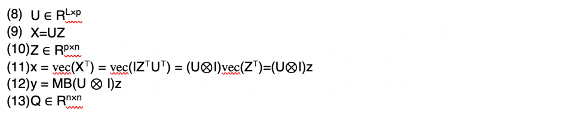

# Super-Resolution of Multispectral Multiresolution Images from a single sensor

## Abstract

원격 감지 센서 : 다양한 스펙트럼 범위 (Sentinel-2  :   육지, 연안 해역의 높은 공간 해상도에서 광학 이미지 수집, MODIS)에서 서로 다른 공간 해상도의 **다중 스펙트럼 이미지**를 수집

연구 목적 : multi resolution sensor의 모든 spectral band를 sensor의 최고 해상도에서 추론하는 데 있다.
- 적응 형 (edge reserving) 정규 표현식을 사용하여 볼록한 목적함수를 최소화로서 이 문제를 공식화한다.
- regulariser는 고해상도 대역의 불연속성을 train하고 다른 bands(대역)로 전송하는 반면,
- data-fitting term은 bands(대역)별 individual blur와 downsampling을 설명한다.
- 또한 data가 저차원(lower-dimensional)의 부분공간에서 표현될 수 있다는 것을 알아내었고, problem의 차원을 줄이고, conditioning을 크게 개선하였다.
- simulated data를 사용한 실험에서, 실제 Sentinel-2 data에 대해 좋은 성능을 냈다.

## Introduction

- 원격 감지 (remote sensing)에서 multispectral bands에 따라 달라지는 multispectral images를 얻는 sensor가 점점 더 많아지고 있다. 이는 위성센서의 경우이며, MODIS, ASTER, VIIRS, Worldview-3, Sentinel-2가 예이다. ( 설계 고려사항, 센서 하드웨어 제한 및 대기 흡수 등의 추가 영향으로 포화된 신호 대 잡음비(SNR)를 달성하기 위해 다양한 채널에 대해 서로 다른 공간 분해능을 사용해야하기 때문 )
- 이런 해상도의 차이가 하드웨어 개선으로 사라지지는 않을것이기 대문에, coarser bands의 해상도를 광 신호의 구조를 이용하여 계산적으로 개선하는 것이 자연스럽다.
- 보편성을 잃지 않고, Sentinel-2(3가지 공간 해상도를 가지며 13개의 band를 가진다)에 초점을 맞춘다. (Table 1)

- **본 연구의 목적은 저해상도 대역의 공간 해상도를 증가시켜 모든 대역이 동일한 최대 해상도를 갖게 하는 것이다.**

- 적외선 spectrum에서 많은 대역이 필요하기 때문에, 환경 및 기후 응용프로그램은 특히 이 접근법의 이점을 얻을 수 있다. 
- 이는 pan-sharpening(사진 선명화 ; 실제 해상도는 고정. Low-res color bands + High-res grayscale band = High-res color image)와의 차이점 
    1. 가장 높은 해상도에서 하나 이상의 channel이 존재할 수 있다
    2. 고해상도 bands가 저해상도 spectrum과 spectrum적으로 겹치지 않아도 된다
    - 하지만 이것만으로는 문제를 해결할 수 없다.따라서 더 다양한 spectral sensitivity와 공간 해상도의 channel을 compact한 imagin model에 합침으로서 한걸음 더 나아간다.
    
    ### Contribution : High -  Quality solution for "Smart Upsampling"
    
   -  blurring이나 downsampling문제를 감안할 때, 모델의 반전(inversion)은 ill-posed problem이다.
   - 이를 극복하기 위해 spectral bands들이 서로 상관되어있기 때문에 대부분의 에너지가 포함되어있는 낮은 차원의 부분공간(lower-dimensional subspace)에서 표현 될 수 있다는 사실을 이용한다. 
   - subspace : parameter수를 줄이고, 게산을 안정화하도록 input data로부터 학습시킨다. 
   - 또한 high-resolution band의 texture 정보를 완전히 활용하여 data의 불연속성을 인코딩하고, 공간 정보를 low resolution bands로 전파함으로써 정규 표현식을 조정해준다.
   - 내재된 주된 가정은, 불연속성이 모든 대역에서 동일한 위치에 있을 가능성이 크다는 것이다.
   - 2차 data항과 적응적인 2차 조정을 고려하여, 관측 모델을 invert시키기 위해 convex(볼록)문제를 공식화하고, 효율적인 수치적 해법을 제안한다.
   - 이 방법은, single step에서 모든 저해상도 대역에 대한 super-resolution을 최대 해상도로 수행한다.
   - "SupReME - SUPer-REsolution for Multiresolution Estimation" ; model name
   
   
   
## Related work (아직 정확한 이해는 하지 못함)

- Tonooka[16] 논문에서는, 가시광 및 근적외선 대역을 사용하여 ASTER의 열 적외선 및 단파 적외선 대역에 대해 스펙트럼 유사성을 이용하여 super-resolution을 수행한다. 
- Aizaai[2] 논문에서는, 일반화된 Laplacian Pyramid 방법을 사용하여 VNIR channel로부터 공간 세부 사항을 주입하여 ASTER TIR channel의 super resolution을 해결한다. 이는 또한 해결을 위해 일반적인 Bayesian data fusion 접근을 제안한다.
- Sirguey[15] 논문에서는, ARSIS 개념을 기반으로 한 wavelet 기반 multiresolution 분석을 injection-type 방법으로 사용하였다.
- Trishchenko[17]은 super-resolved channel의 radiometric 일관성을 보존하기 위해 비선형 회귀와 정규화 제안
- wang[20]은 regression 모델링에서 출발한 ATPRK라고 하는 fan-sharpening 방법을 제한하고, 저해상도 대역의 spectral property들을 준수하기 위해 residual upsampling을 이용합니다. 이는 하나의 고해상도 이미지만 허용하기 때문에, 스펙트럼에 가장 가가운 10m band 또는 10m band의 평균을 사용하는 것이 좋다.
- Du[6]는 S2 data의 SWIR band(B11)를 sharpening하기위한 4가지의 다른 pan-sharpening 방법을 비교한다.
- Vaiopoulos,Karantzalos[18]은 21개의 fusion 알고리즘을 비교하여 S2의 VNIR과 SWIR bands를 선명하게 했다.

## Problem Formulation
loss of generality 없이, 우리는 Sentinel-2 data를 위한 모델을 제시한다.

* Input = L = L1 + L2 + L6 spectrual bands
    * L1 = GSD 10m를 가지는 4개의 high resolution bands
    * L2 = GSD 20m를 가지는 6개의 medium resolution bands
    * L3 = GSD 30m를 가지는 3개의 low rewolution bands
    
* Output  : 모든 대역에 대해 10m 해상도를 갖도록 한다. 
    * upsampling factor : r1 = 1, r2 = 2, r6 = 6
    * fixed image area contains : n = n1 = n/(r1^2) high resolution pixels,
                                                        n2 = n/(r2^2) medium resolution pixels,
                                                        n3 = n/(r6^2) low resolution pixels

이 논문의 방법을 도출하기 위해 **image를 벡터화**하는 것이 편리하다. 
- 각각의 개별 band의 pixel intensities : vector yi 로 수집, 이는 임의의 고정된 순서로 연결(1)된다.
- 유사하게, 알려지지 않은 output images는 (2)이지만, 모든 대역은 동일한 최대의 해상도 (3)을 갖는다.
- 따라서,  output bands는 필요하다면 matrix (4)로 변경될 수 있고, (5)가 성립한다.
- 입력 및 출력 이미지는 noise에 따라 관측 모델(6)을 통해 연관된다. 이 때, (7)은 두개의 블록 대각행렬(대각선 이외의 모든 행렬 블록이 영행렬인 블록행렬)이다.
- 두 행렬의 sub block들은 하나의 스펙트럼 대역에서 작동한다.
- M : block은 y를 얻기 위한 x sampling을 나타냄
    1. 즉 block은 고해상도 채널에 대해서는 항등행렬이고, 
    2. 다른 채널, 즉 항등행렬의 행의 subset에 대해서는 down-sampling(mask) 함수 이다.
-  B : blur matrix. block-circulant-cirtulant-block(BCCB) 행렬
    1. 각 블록은 x의 해상도(가장 높은 공간해상도)에서 해당 밴드에 해당하는 point spread function(PSF)와 연관된 2D cyclic convolution을 나타낸다.
    2. blur는 모든 spectral band에서 다를 수 있으며, 공간적으로 불변하다.
- ill-posed problem이기 대문에, 식 (6)은 분명히 좋지 않다. 

### Subspace representation
- 다중 스펙트럼 이미지 데이터는 상관관계가 있으며, 정보를 잃지 않고 더 낮은 차원의 부분 공간으로 투영될 수 있다는 것이 종종 관찰되었다.
- S2의 13개 bands에 대해, 신호 에너지의 99%이상이 correlation 기반 고윳값 분해의 p=6인 최대 구성요소에 유지된다는 것을 알 수 있다.
- 차원 감소 : 미지의 수를 상당히 줄이고, 구상된 super-resolution을 위한 암시적 또는 명시적으로 사용된 핵심요소임을 증명한다.
- 공식적으로, X의 열, 즉 spectral vector는 (8)의 열에 걸친 부분 공간에 존재하므로, (9)와 같이 쓸 수 있다. 여기서 (10)은 U에 대한 표현 계수이고, U는 semi-unitary(반 단위)라고 가정합니다.
-   행렬의 벡터화는 (11)을 산출하며, 여기서 I는 적절한 차원을 같는 항등행렬이다.
- 차원 감소와 함께, (6)은 (12)가 된다.
- 축소된 문제는 pn < L1n1 + L2n2 + L6n6인 이상 더이상 ill-posed가 아니다.
- 하지만 여전히 ill-conditioned이다.
- 직접적인 해결책은 noise에 민감하고 크기가 작기 때문에 실용적이지 않다.

**Estimation of the subspace**
- 부분공간 U를 계산하려면, 각각 span(X)에 대응하는 X에 접근해야한다.
- 하지만 우리는 blur되고 downsampling된 X, 즉 y만 가지고 있다.
- Q (13) : 2D cyclic convolution을 나타내는 blurring matrix   
- 목적 : X, XQ의 blurred 버전을 사용하여  span(X)를 추정
- 이 목적의 주된 동기는,  X columns와 rank(Q)≥ p의 선형조합이라는 것을 감안할 때,blurring operator Q가 span(X)에 영향을 미치지 않는다,즉 span(X)=span(XQ) 라는 것이다.
- 이를 위해, 1) y의 모든 band를 bicubic interpolation으로 동일한 high resolution으로 upsampling하고, 2) 모든 band의 blur가 가장 강한 blur와 동등하게 되도록 각 밴드를 흐리게 처리한다. 이 이미지는 XQ의 최적 근사치 역할을 한다.
- 다음으로, 흐린 데이터에 대해 특이 값 분해 분석 진행
- 특이값이 내림차순으로 존재할 때, 왼쪽부터 p개의 특이값을 U의 columns로 유지
- 이 방법으로, U의 column과 x의 column이 동일한 부분공간에 걸쳐있다고 가정
    
    
## Proposed Solution

우리는 위 최적화 문제를 풀어야 한다. 
- 앞부분은 위에서 계속 이야기했던 수식이며, 
- 뒷부분은 regularization strength와 regularization term이다. 
- w,q = weight, 뒤에서 자세히 설명
- Dh,Dv(R^(Ln*Ln)) = z에 있는 이미지의 수평 및 수직 미분을 근사하는 두 개의 각각 identical block을 가지는 block diagonal linear operators
- 단순화를 위해, 이 행렬들을 cyclic convolution로서의 주기적인 경계 조건을 가지고 다룬다.

- 정규 표현식에서는 위 식과 같은 2차 형식을 선택하는데, 여기서 i는 subspace dim에서 실행되고, j는 basis vector i에 대한 모든 픽셀에서 실행된다.
- Hh, Hv ( R^(n*n))은 finite difference operators Dh, Dv의 단위(I)블록
- Dh = I ⊗ Hh, Dv =I⊗Hv 가 된다. 

 최종적으로 풀어야하는 맨 위 식을 풀기 위해서, ADMM 대신 C-SALSA를 이용한다. 
    - ADMM :
    - C-SALSA : 
