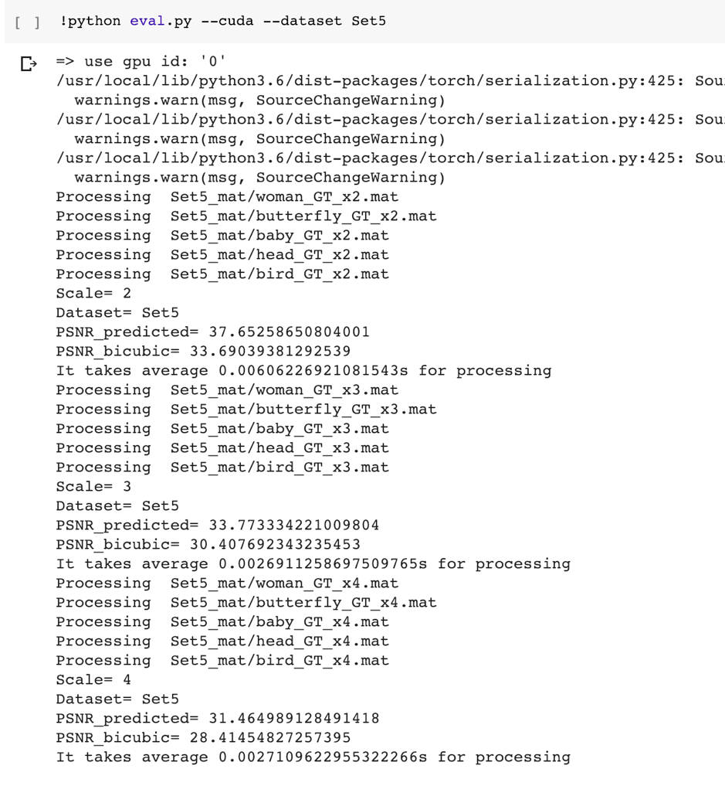
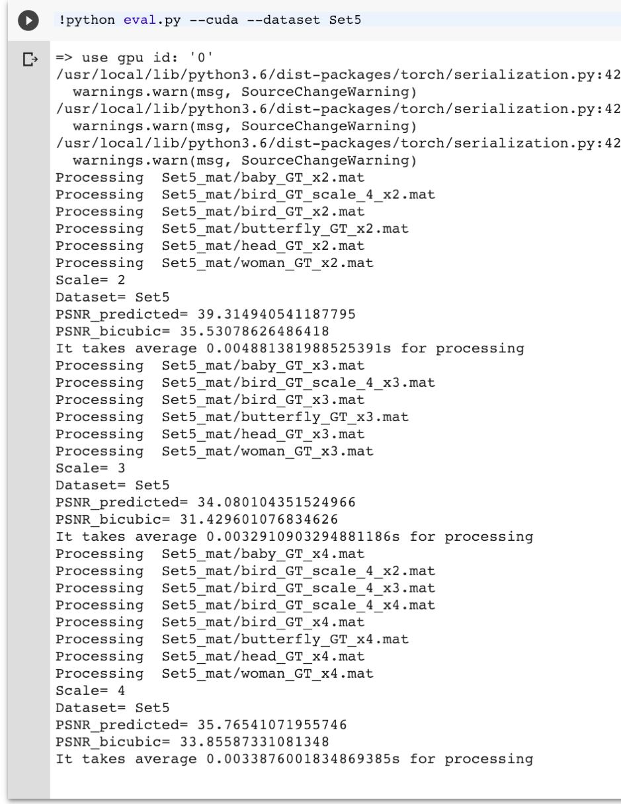
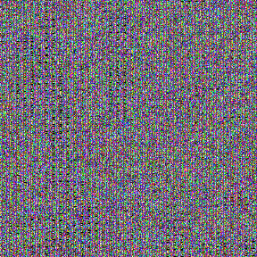
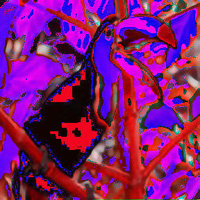
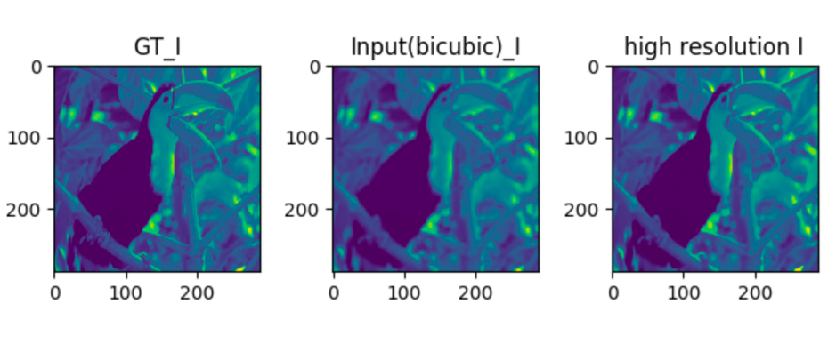

# VDSR code에서 YCbCr to HSI
기존의 VDSR은 RGB를 YCbCr로 바꾸어 Y성분의 residual로 super-resolution을 진행하지만,  
HSI의 I 성분을 이용하여 super-resolution을 진행해보려 한다.  

## generate_train.m

H,S,I성분 중 I 성분만으로 train을 시키기 때문에, H,S 성분은 필요하지 않다.  
따라서 복잡하게 RGB를 HSI 성분 전체로 변환할 필요 없이,  
간단한 식 I = (R+G+B)/3 공식을 사용하여 I 성분만을 구해주면 된다.   

기존 코드   
~~~
% rgb to ycbcr ,,,, if dim is not 3, we can make it hsi, use i instead of ycbcr Y data
image = rgb2ycbcr(image);
image = im2double(image(:, :, 1));
~~~
이 부분은, RGB를 YCbCr로 바꾸어 image = Y 성분이 되도록 만들어 주는 코드이다.  
  
image = I 성분이 되도록 코드를 변경하였다.  
변경한 코드  
~~~
rgb = im2double(image);
r = rgb(:, :, 1);
g = rgb(:, :, 2);
b = rgb(:, :, 3);

image = (r+g+b)/3
~~~

## generate_test_mat.m

 HSI의 bicubic data와 ground truth 사이의 PSNR test를 위한 mat을 만들어주는 코드이다.
 전체적으로 바뀌었기 때문에 코드 전체를 첨부하였다.  
   
일단 전체적으로 ycbcr -> hsi, y -> i 로 바꾸어주었고,  
실제로 color space를 변경하기 위해서 rgb2hsi, hsi2rgb 함수를 따로 만들어서 사용하였다.  
 
 기존 코드   
~~~
clear;close all;
%% settings
folder = 'Set5';

%% generate data
filepaths = [];
filepaths = [filepaths; dir(fullfile(folder, '*.bmp'))];

scale = [2, 3, 4];

for i = 1 : length(filepaths)
im_gt = imread(fullfile(folder,filepaths(i).name));
for s = 1 : length(scale)
% crop as scale
im_gt = modcrop(im_gt, scale(s));
% make dataset double
im_gt = double(im_gt);
% ground truth ycbcr
im_gt_ycbcr = rgb2ycbcr(im_gt / 255.0);
%im_gt_i = im_gt[][] * 255.0;

%low
im_l_ycbcr = imresize(im_gt_ycbcr,1/scale(s),'bicubic');
%bicubic
im_b_ycbcr = imresize(im_l_ycbcr,scale(s),'bicubic');

%low Y
im_l_y = im_l_ycbcr(:,:,1) * 255.0;
%low RGB
im_l = ycbcr2rgb(im_l_ycbcr) * 255.0;

% bicubic Y
im_b_y = im_b_ycbcr(:,:,1) * 255.0;
% bicubic rgb
im_b = ycbcr2rgb(im_b_ycbcr) * 255.0;

% last = exept name after dot
last = length(filepaths(i).name)-4;
%sprintf
filename = sprintf('Set5_mat/%s_x%s.mat',filepaths(i).name(1 : last),num2str(scale(s)));
% save at filename, these things
save(filename, 'im_gt_y', 'im_b_y', 'im_gt', 'im_b', 'im_l_ycbcr', 'im_l_y', 'im_l');
end
end
~~~

변경한 코드  
~~~
clear;close all;
%% settings
folder = '../Set5';

%% generate data
filepaths = [];
filepaths = [filepaths; dir(fullfile(folder, '*.png'))];

scale = [2, 3, 4];

for i = 1 : length(filepaths)
im_gt = imread(fullfile(folder,filepaths(i).name));

for s = 1 : length(scale)
% crop as scale
im_gt = modcrop(im_gt, scale(s));

% make dataset double
im_gt = double(im_gt);

R=im_gt(:,:,1);
G=im_gt(:,:,2);
B=im_gt(:,:,3);
gt_I=(R+G+B)/3;

% ground truth ycbcr
%im_gt_ycbcr = rgb2ycbcr(im_gt / 255.0);
im_gt_hsi = rgb2hsi(im_gt);

%im_gt_y = im_gt_ycbcr(:,:,1) * 255.0;
im_gt_i = gt_I;

%low
im_l_hsi = imresize(im_gt_hsi,1/scale(s),'bicubic');
%bicubic
im_b_hsi = imresize(im_l_hsi,scale(s),'bicubic');

%low Y
im_l_i = im_l_hsi(:,:,3);
%low RGB
im_l = hsi2rgb(im_l_hsi);

% bicubic Y
im_b_i = im_b_hsi(:,:,3)
% bicubic rgb
im_b = hsi2rgb(im_b_hsi);

% last = exept name after dot
last = length(filepaths(i).name)-4;
%sprintf
filename = sprintf('../Set5_mat/%s_x%s.mat',filepaths(i).name(1 : last),num2str(scale(s)));
% save at filename, these things
save(filename, 'im_gt_i', 'im_b_i', 'im_gt', 'im_b', 'im_l_hsi', 'im_l_i', 'im_l');
end
end

%% hsi 2 rgb
function outpict=hsi2rgb(inpict)
%   HSI2RGB(INPICT)
%       undoes an HSI conversion from (RGB2HSI)
%
%   INPICT is an image of class double wherein
%       H \in [0 360)
%       S \in [0 1]
%       I \in [0 1]
%
%   Return type is double, scaled [0 1]
%
%   See also: RGB2HSI
% keep in mind that not all color points in the cylinder
% specified by the extents listed above are still in the sRGB cube
% keep in mind that HSI is not a biconic model
% the isosurfaces of S (cone) and I (plane) intersect beyond the cube
% for large S and I
H=inpict(:,:,1);
S=inpict(:,:,2);
I=inpict(:,:,3);
H=H-360*floor(H/360);

% sector masks
a=H<120;
b=H<240 & ~a;
c=~a & ~b;
R=zeros(size(H));
G=zeros(size(H));
B=zeros(size(H));
B(a)=I(a).*(1-S(a));
R(a)=I(a).*(1+S(a).*cos(H(a).*(pi/180))./cos((60-H(a))*(pi/180)));
G(a)=3*I(a)-R(a)-B(a);
H(b)=H(b)-120;
R(b)=I(b).*(1-S(b));
G(b)=I(b).*(1+S(b).*cos(H(b).*(pi/180))./cos((60-H(b))*(pi/180)));
B(b)=3*I(b)-R(b)-G(b);
H(c)=H(c)-240;
G(c)=I(c).*(1-S(c));
B(c)=I(c).*(1+S(c).*cos(H(c).*(pi/180))./cos((60-H(c))*(pi/180)));
R(c)=3*I(c)-G(c)-B(c);
outpict=cat(3,R,G,B);
end

%% rgb 2 hsi
function outpict=rgb2hsi(inpict)
%   RGB2HSI(INPICT)
%       performs an HSI conversion on an rgb image
%
%   INPICT is an rgb image of class uint8 or double
%
%   Return type is double, scaled as such:
%       H \in [0 360)
%       S \in [0 1]
%       I \in [0 1]
%
%   See also: HSI2RGB
inpict = im2double(inpict)
R=inpict(:,:,1);
G=inpict(:,:,2);
B=inpict(:,:,3);
a=0.5*(2*R-G-B);
b=sqrt(3)/2*(G-B);

H=zeros(size(R));
S=zeros(size(R));
I=(R+G+B)/3;
mn=min(inpict,[],3);
nz=I~=0;
S(nz)=1-mn(nz)./I(nz);
S(~nz)=0;
H(nz)=atan2(b(nz),a(nz))*(180/pi);
H(H<0)=H(H<0)+360;
H(~nz)=0;
outpict=cat(3,H,S,I);
end

~~~

## eval.py
코드의 큰 변화는 없고, 변수명 정도만 변경하였다. 코드는 생략하겠다.  
* YCbCr 사용하였을 때의 evaluation  
  
  
* YCbCr 사용하였을 때의 evaluation  

## demo.py
generate_test_mat.m와 같이 RGB2HSI, HSI2RGB를 만들어주어야 한다.  
위에서 matlab으로 만들어 사용하였으나, python버전은 없어 직접 만들어주었다.  
  
이미지를 불러올 때, 바로 HSI space로 불러올 수 없어서, 기존 YCbCr을 사용할때와 다르게  
이미지를 일단 RGB로 만들어 준 뒤 HSI로 변경하였다.   
  
처음에 설정한 함수는 다음과 같다.  
* RGB2HSI (잘못된 코드)
~~~
def RGB2HSI(rgb) :
rgb = rgb.astype(float);
r = rgb[:, :, 0];
g = rgb[:, :, 1];
b = rgb[:, :, 2];

h= math.acos((((r-g)+(r-b))*(0.5))/(((r-g)**2+(r-b)*(g-b))**(0.5)))

if b<=g :
H = h;
else :
H = 360-h;

S= 1 - 3/(r+g+b)*min(r,g,b)

I=(R+G+B)/3;

HSI = zeros(size(rgb))
HSI[:,:,1] = H;
HSI[:,:,2] = S;
HSI[:,:,3] = I;

return HSI
~~~

* HSI2RGB
~~~
def HSI2RGB(h_i,b_hsi) : # H,S 성분은 im_b_hsi와 동일하다.
# 즉 변경된 i 성분을 가지고 super resolution을 진행하는 것!
h = b_hsi[:,:,1];
s = b_hsi[:,:,2];
i = h_i;

if h >=0 and h<120 :
B = i(1-s);
R = i(1 + (  ( s * math.cos(h) ) / ( math.cos(60-h) ) ) );
G = 3*i - (R+B);
elif h>=120 and h<240 :
h = h-120;
R = i(1-s);
G = i(1 + (  ( s * math.cos(h) ) / ( math.cos(60-h) ) ) );
B = 3*i - (R+G)
elif h>=240 and h<=360 :
h = h-240;
G = i(1-s);
B = i(1 + (  ( s * math.cos(h) ) / ( math.cos(60-h) ) ) );
R = 3*i - (G+B);

RGB = zeros(size(b_hsi))
RGB[:,:,0] = R;
RGB[:,:,1] = G;
RGB[:,:,2] = B;
return RGB
~~~

### error fix

~~~
h= math.acos((((r-g)+(r-b))*(0.5))/(((r-g)**2+(r-b)*(g-b))**(0.5)))   
TypeError: only size-1 arrays can be converted to Python scalars   
~~~
- math.acos 대신 numpy.arccos 사용하여 해결   

~~~
if b<=g:
ValueError: The truth value of an array with more than one element is ambiguous. Use a.any() or a.all()
~~~
- array의 성분이 다양하기때문에, 어떻게 비교를 해야하는지에서 애매하다고 에러가 나는 것 같다.   
array의 크기를 구해서, 각각의 성분에 대하여 구별을 하여 픽셀 값을 정할 수 있도록 해주어야겠다.

R :  [[ 19.  19.  15. ... 107. 124. 139.]
[ 19.  18.  13. ... 132. 146. 157.]
[ 16.  15.  11. ... 146. 148. 142.]. 
...  
[156.  88. 123. ...  27.  34.  39.]
[166.  96. 110. ...  27.  34.  39.]
[172. 106. 101. ...  27.  34.  39.]]  
G :  [[ 40.  39.  35. ... 135. 149. 163.]
[ 38.  37.  32. ... 159. 172. 182.]
[ 35.  34.  30. ... 171. 173. 168.]  
...  
[167.  93. 124. ...  87.  88.  88.]
[177. 101. 111. ...  87.  89.  88.]
[183. 111. 102. ...  87.  90.  89.]]  
B :  [[ 18.  17.  15. ...  76. 104. 131.]
[ 16.  15.  12. ... 122. 147. 165.]
[ 13.  12.  10. ... 154. 152. 140.]   
...  
[118.  41.  68. ...  27.  29.  31.]
[128.  49.  55. ...  25.  26.  27.]
[134.  59.  46. ...  23.  22.  24.]].  
  
    
이후 array를 사진으로 나타낼 수 없다는 에러가 생겼고, Image.fromarray()함수를 사용하였으나 아래 에러가 또 나타났다. 
~~~
AttributeError: 'NoneType' object has no attribute '__array_interface__'
~~~
- 여러 방법으로 array를 image로 바꾸려고 하고 있으나, 게속 NoneType error가 뜬다. 

- im_h 에 값이 들어가지 않았다. ( print의 결과 = None)

-  return 문제였다. (해결)

### HSI output
demo.py
~~~
import argparse, os
import torch
from torch.autograd import Variable
from scipy.ndimage import imread
from PIL import Image
import numpy as np
import time, math
import matplotlib.pyplot as plt
from functools import partial
import pickle
import math
import numpy
import PIL
from PIL import Image
import cv2

pickle.load = partial(pickle.load, encoding="latin1")
pickle.Unpickler = partial(pickle.Unpickler, encoding="latin1")

parser = argparse.ArgumentParser(description="PyTorch VDSR Demo")
parser.add_argument("--cuda", action="store_true", help="use cuda?")
parser.add_argument("--model", default="model/model_epoch_50.pth", type=str, help="model path")
parser.add_argument("--image", default="butterfly_GT", type=str, help="image name")
parser.add_argument("--scale", default=4, type=int, help="scale factor, Default: 4")
parser.add_argument("--gpus", default="0", type=str, help="gpu ids (default: 0)")

def PSNR(pred, gt, shave_border=0):
height, width = pred.shape[:2]
pred = pred[shave_border:height - shave_border, shave_border:width - shave_border]
gt = gt[shave_border:height - shave_border, shave_border:width - shave_border]
imdff = pred - gt
rmse = math.sqrt(np.mean(imdff ** 2))
if rmse == 0:
return 100
return 20 * math.log10(255.0 / rmse)

def RGB2HSI(rgb):
rgb = np.array(rgb.astype(float));
r = rgb[:, :, 0];
g = rgb[:, :, 1];
b = rgb[:, :, 2];

rs = len(r)
#gs = len(g)
#bs = len(b)

rs1 = len(r[0])
#gs1 = len(g[0])
#bs1 = len(b[0])

H = numpy.zeros([len(r),len(r[0])])
S = numpy.zeros([len(r),len(r[0])])
I = numpy.zeros([len(r),len(r[0])])
p = numpy.zeros([len(r),len(r[0])])
q = numpy.zeros([len(r),len(r[0])])
w = numpy.zeros([len(r),len(r[0])])
h = numpy.zeros([len(r),len(r[0])])

for i in range(0, rs) :
for j in range(0, rs1) :
p[i][j] = ((r[i][j]-g[i][j])+(r[i][j]-b[i][j]))*(0.5)
q[i][j] = ((r[i][j]-g[i][j])**2+(r[i][j]-b[i][j])*(g[i][j]-b[i][j]))**(0.5)
w[i][j]=(((r[i][j]-g[i][j])+(r[i][j]-b[i][j]))*(0.5))/(((r[i][j]-g[i][j])**2+(r[i][j]-b[i][j])*(g[i][j]-b[i][j]))**(0.5))

h[i][j] = numpy.arccos(w[i][j])

I[i][j]=(r[i][j]+g[i][j]+b[i][j])/3
S[i][j]= 1 - 3/(r[i][j]+g[i][j]+b[i][j])*min(r[i][j],g[i][j],b[i][j])

if b[i][j]<=g[i][j]:
H[i][j] = h[i][j]
else:
H = 360-h

HSI = numpy.zeros([len(H),len(H[0]),4])
HSI[:,:,1] = H;
HSI[:,:,2] = S;
HSI[:,:,3] = I;

return HSI

def HSI2RGB(h_i,b_hsi): # H,S 성분은 im_b_hsi와 동일하다.
# 즉 변경된 i 성분을 가지고 super resolution을 진행하는 것!
h = b_hsi[:,:,1];
s = b_hsi[:,:,2];
i = h_i;

hs = len(h)
hs1 = len(h[0])

R = numpy.zeros([len(h),len(h[0])])
G = numpy.zeros([len(h),len(h[0])])
B = numpy.zeros([len(h),len(h[0])])

for k in range(0, hs) :
for j in range(0, hs1) :
if h[k][j] >=0 and h[k][j]<120:
B[k][j] = i[k][j]*(1-s[k][j]);
R[k][j] = i[k][j]*(1 + (  ( s[k][j] * math.cos(h[k][j]) ) / ( math.cos(60-h[k][j]) ) ) );
G[k][j] = 3*i[k][j] - (R[k][j]+B[k][j]);
elif h[k][j]>=120 and h[k][j]<240:
h[k][j] = h[k][j]-120;
R[k][j] = i[k][j]*(1-s[k][j]);
G[k][j] = i[k][j]*(1 + (  ( s[k][j] * math.cos(h[k][j]) ) / ( math.cos(60-h[k][j]) ) ) );
B[k][j] = 3*i[k][j] - (R[k][j]+G[k][j])
elif h[k][j]>=240 and h[k][j]<=360:
h[k][j] = h[k][j]-240;
G[k][j] = i[k][j]*(1-s[k][j]);
B[k][j] = i[k][j]*(1 + (  ( s[k][j] * math.cos(h[k][j]) ) / ( math.cos(60-h[k][j]) ) ) );
R[k][j] = 3*i[k][j] - (G[k][j]+B[k][j]);

RGB = numpy.zeros([len(R),len(R[0]),3])
RGB[:,:,0] = R;
RGB[:,:,1] = G;
RGB[:,:,2] = B;

return RGB

opt = parser.parse_args()
cuda = opt.cuda

if cuda:
print("=> use gpu id: '{}'".format(opt.gpus))
os.environ["CUDA_VISIBLE_DEVICES"] = opt.gpus
if not torch.cuda.is_available():
raise Exception("No GPU found or Wrong gpu id, please run without --cuda")

model = torch.load(opt.model, map_location=lambda storage, loc: storage,pickle_module=pickle)["model"]

im_gt_rgb = imread("Set5/" + opt.image + ".png", mode="RGB")
im_b_rgb = imread("Set5/"+ opt.image + "_scale_"+ str(opt.scale) + ".png", mode="RGB")

# make rgb to shi function
im_gt_hsi = RGB2HSI(im_gt_rgb) # not needed...
im_b_hsi = RGB2HSI(im_b_rgb) # need to make full high resolution hsi img

# RGB to HSI and get I data

im_gt_i = im_gt_hsi[:,:,3]
im_b_i = im_b_hsi[:,:,3]

#psnr_bicubic = PSNR(im_gt_i, im_b_i,shave_border=opt.scale)

im_input = im_b_i

im_input = Variable(torch.from_numpy(im_input).float()).view(1, -1, im_input.shape[0], im_input.shape[1])

if cuda:
model = model.cuda()
im_input = im_input.cuda()
else:
model = model.cpu()

start_time = time.time()
out = model(im_input)
elapsed_time = time.time() - start_time

out = out.cpu()

im_h_i = out.data[0].numpy().astype(np.float32)

# im_h_y = im_h_y * 255.
im_h_i[im_h_i < 0] = 0
im_h_i[im_h_i > 255.] = 255.

# psnr_predicted = PSNR(im_gt_y, im_h_y[0,:,:], shave_border=opt.scale)

# have to make HSI to RGB
im_h = HSI2RGB(im_h_i[0,:,:], im_b_hsi)
im_gt = im_gt_rgb
im_b = im_b_rgb

im_h = np.array(im_h)
im_gt = np.array(im_gt)
im_b = np.array(im_b)

im_b = Image.fromarray(im_b, 'RGB')
im_gt = Image.fromarray(im_gt, 'RGB')
im_h = Image.fromarray(im_h, 'RGB')

# svimg=im.fromarray(data.astype('uint8'))

im_b.save("inputBicu.png")
im_gt.save("groundTruth.png")
im_h.save("hsiOutput.png")
~~~
이렇게 진행하였을 때, 

- 원하는 high resoltuion 사진으로 나오지 않는다...
- 코드가 잘못된것인지 HSI로 super-resolution을 진행할 수 없는 것인지 확인해봐야겠다.
  
- 일단, array를 image로 바꾸는 과정에서 난 에러가 아닐까 생각해서 고쳐보는 중이다. 

------

이미지 출력부분을 다음과 같이 변경한 결과물이다.  
~~~
'''
im_h = np.array(im_h)
im_gt = np.array(im_gt)
im_b = np.array(im_b)
'''
#print("Scale=",opt.scale)
#print("PSNR_predicted=", psnr_predicted)
#print("PSNR_bicubic=", psnr_bicubic)
#print("It takes {}s for processing".format(elapsed_time))

im_b = Image.fromarray(im_b.astype('unit8'))
im_gt = Image.fromarray(im_gt.astype('unit8'))
im_h = Image.fromarray(im_h.astype('unit8'))

# svimg=im.fromarray(data.astype('uint8'))

im_b.save("inputBicu.png")
im_gt.save("groundTruth.png")
im_h.save("vdsrOutput.png")
~~~

------

두 결과로 보아, array를 image로 변경하는 과정에서 코드를 잘 변경하여야할 것 같다. 

bicubic, high resolution, ground truth 행렬을 출력해보니, 순서가 잘못된 것 같기도 하다. 

------
01/18  
  
    
  
i 성분만을 출력한것으로, 해상도가 높아진것을 볼 수 있다. hsi to rgb의 문제인 것 같다.   
  
코드 생성시 실수들을 고치고 나니, hsi의 i를 사용한 vdsr을 만드는 것에 성공하였다. ( 1_18.docx)  
  
최종 demo.py code  
~~~
import argparse, os
import torch
from torch.autograd import Variable
from scipy.ndimage import imread
from PIL import Image
import numpy as np
import time, math
import matplotlib.pyplot as plt
from functools import partial
import pickle
import math
import numpy
import PIL
from PIL import Image
import cv2

pickle.load = partial(pickle.load, encoding="latin1")
pickle.Unpickler = partial(pickle.Unpickler, encoding="latin1")

parser = argparse.ArgumentParser(description="PyTorch VDSR Demo")
parser.add_argument("--cuda", action="store_true", help="use cuda?")
parser.add_argument("--model", default="model/model_epoch_50.pth", type=str, help="model path")
parser.add_argument("--image", default="bird_GT", type=str, help="image name")
parser.add_argument("--scale", default=2, type=int, help="scale factor, Default: 4")
parser.add_argument("--gpus", default="0", type=str, help="gpu ids (default: 0)")

pi = 3.14159265358979

def PSNR(pred, gt, shave_border=0):
height, width = pred.shape[:2]
pred = pred[shave_border:height - shave_border, shave_border:width - shave_border]
gt = gt[shave_border:height - shave_border, shave_border:width - shave_border]
imdff = pred - gt
rmse = math.sqrt(np.mean(imdff ** 2))
if rmse == 0:
return 100
return 20 * math.log10(255.0 / rmse)

def RGB2HSI(rgb):
rgb = np.array(rgb.astype(float));
r = rgb[:, :, 0];
g = rgb[:, :, 1];
b = rgb[:, :, 2];

rs = len(r)
# gs = len(g)
# bs = len(b)

rs1 = len(r[0])
# gs1 = len(g[0])
# bs1 = len(b[0])

H = numpy.zeros([len(r), len(r[0])])
S = numpy.zeros([len(r), len(r[0])])
I = numpy.zeros([len(r), len(r[0])])
p = numpy.zeros([len(r), len(r[0])])
q = numpy.zeros([len(r), len(r[0])])
w = numpy.zeros([len(r), len(r[0])])
h = numpy.zeros([len(r), len(r[0])])

for i in range(0, rs):
for j in range(0, rs1):
p[i][j] = ((r[i][j] - g[i][j]) + (r[i][j] - b[i][j])) * (0.5)
q[i][j] = ((r[i][j] - g[i][j]) ** 2 + (r[i][j] - b[i][j]) * (g[i][j] - b[i][j])) ** (0.5)
w[i][j] = (((r[i][j] - g[i][j]) + (r[i][j] - b[i][j])) * (0.5)) / (
((r[i][j] - g[i][j]) ** 2 + (r[i][j] - b[i][j]) * (g[i][j] - b[i][j])) ** (0.5))

h[i][j] = numpy.arccos(w[i][j])

I[i][j] = (r[i][j] + g[i][j] + b[i][j]) / 3
S[i][j] = 1 - 3 / (r[i][j] + g[i][j] + b[i][j]) * min(r[i][j], g[i][j], b[i][j])

if b[i][j] <= g[i][j]:
H[i][j] = h[i][j]
else:
H = 2*pi - h

HSI = numpy.zeros([len(H), len(H[0]), 4])
HSI[:, :, 1] = H;
HSI[:, :, 2] = S;
HSI[:, :, 3] = I;

return HSI

def HSI2RGB(h_i, b_hsi):  # H,S 성분은 im_b_hsi와 동일하다.
# 즉 변경된 i 성분을 가지고 super resolution을 진행하는 것!
h = b_hsi[:, :, 1];
s = b_hsi[:, :, 2];
i = h_i;

hs = len(h)
hs1 = len(h[0])

R = numpy.zeros([hs, hs1])
G = numpy.zeros([hs, hs1])
B = numpy.zeros([hs, hs1])

for k in range(0, hs):
for j in range(0, hs1):
if h[k][j] >= 0 and h[k][j] < pi*2/3:
B[k][j] = i[k][j] * (1 - s[k][j]);
R[k][j] = i[k][j] * (1 + ((s[k][j] * math.cos(h[k][j])) / (math.cos(pi/3 - h[k][j]))));
G[k][j] = 3 * i[k][j] - (R[k][j] + B[k][j]);
elif h[k][j] >= pi*2/3 and h[k][j] < pi*4/3:
h[k][j] = h[k][j] - pi*2/3;
R[k][j] = i[k][j] * (1 - s[k][j]);
G[k][j] = i[k][j] * (1 + ((s[k][j] * math.cos(h[k][j])) / (math.cos(pi/3 - h[k][j]))));
B[k][j] = 3 * i[k][j] - (R[k][j] + G[k][j])
elif h[k][j] >= pi*4/3 and h[k][j] <= pi*2:
h[k][j] = h[k][j] - pi*4/3;
G[k][j] = i[k][j] * (1 - s[k][j]);
B[k][j] = i[k][j] * (1 + ((s[k][j] * math.cos(h[k][j])) / (math.cos(pi/3 - h[k][j]))));
R[k][j] = 3 * i[k][j] - (G[k][j] + B[k][j]);

RGB = numpy.zeros([len(R), len(R[0]), 3])
RGB[:, :, 0] = R;
RGB[:, :, 1] = B;
RGB[:, :, 2] = G;

return RGB

opt = parser.parse_args()
cuda = opt.cuda

if cuda:
print("=> use gpu id: '{}'".format(opt.gpus))
os.environ["CUDA_VISIBLE_DEVICES"] = opt.gpus
if not torch.cuda.is_available():
raise Exception("No GPU found or Wrong gpu id, please run without --cuda")

model = torch.load(opt.model, map_location=lambda storage, loc: storage, pickle_module=pickle)["model"]

im_gt_rgb = imread("Set5/" + opt.image + ".png", mode="RGB")
im_b_rgb = imread("Set5/" + opt.image + "_scale_" + str(opt.scale) + ".png", mode="RGB")

print(im_gt_rgb)

# make rgb to shi function
im_gt_hsi = RGB2HSI(im_gt_rgb)  # not needed...
im_b_hsi = RGB2HSI(im_b_rgb)  # need to make full high resolution hsi img

# RGB to HSI and get I data

im_gt_i = im_gt_hsi[:, :, 3]
im_b_i = im_b_hsi[:, :, 3]

psnr_bicubic = PSNR(im_gt_i, im_b_i,shave_border=opt.scale)

im_input = im_b_i

im_input = Variable(torch.from_numpy(im_input).float()).view(1, -1, im_input.shape[0], im_input.shape[1])

if cuda:
model = model.cuda()
im_input = im_input.cuda()
else:
model = model.cpu()

start_time = time.time()
out = model(im_input)
elapsed_time = time.time() - start_time

out = out.cpu()

im_h_i = out.data[0].numpy().astype(np.float32)

# im_h_y = im_h_y * 255.
im_h_i[im_h_i < 0] = 0
im_h_i[im_h_i > 255.] = 255.

psnr_predicted = PSNR(im_gt_i, im_h_i[0,:,:], shave_border=opt.scale)

# have to make HSI to RGB
im_h = HSI2RGB(im_h_i[0, :, :], im_b_hsi)
im_gt = im_gt_rgb
im_b = im_b_rgb

print("im_gt",im_gt)
print("im_h",im_h)
print("im_b",im_b)

'''
im_h = np.array(im_h)
im_gt = np.array(im_gt)
im_b = np.array(im_b)
'''
print("Scale=",opt.scale)
print("PSNR_predicted=", psnr_predicted)
print("PSNR_bicubic=", psnr_bicubic)
print("It takes {}s for processing".format(elapsed_time))

im_b = Image.fromarray(im_b.astype('uint8'))
im_gt = Image.fromarray(im_gt.astype('uint8'))
im_h = Image.fromarray(im_h.astype('uint8'))

# svimg=im.fromarray(data.astype('uint8'))

im_b.save("inputBicu.png")
im_gt.save("groundTruth.png")
im_h.save("vdsrOutput.png")

fig = plt.figure()
ax = plt.subplot("131")
ax.imshow(im_gt)
ax.set_title("GT_I")

ax = plt.subplot("132")
ax.imshow(im_b)
ax.set_title("Input(bicubic)_I")

ax = plt.subplot("133")
ax.imshow(im_h)
ax.set_title("high resolution I")
plt.show()
~~~  
하지만, 두가지 문제점 및 의문사항이 존재한다.  
1. 흑백사진을 input으로 넣으면, 검정색 결과가 나온다. 컬러이미지에서도 흑백으로 판단되는 부분은 검정색이 된다.
2. 일부 부분 색상의 변화가 생긴다. G,B의 문제인 것 같은데, 3번과 함께 해결하면 될 것 같다.
3. 코드가 잘 돌아가기는 하나, hsi to rgb에서 구한 G,B값을 바꾼 경우 잘 돌아간다. 코드가 잘못되었나..?
4. HSI성분을 배열로 나타낼 때, 1,2,3으로 나타내는데, 0은 어떤 data인가?
