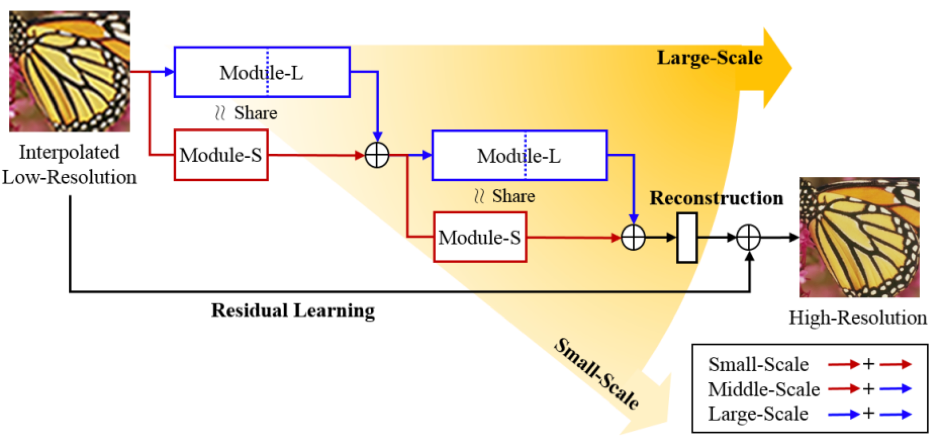

# Multi-scale Super-Resolution

저 해상도 -> 고 해상도 복원 분제는 ill-posed problem이다. 
이웃에 있는 더 많은 context information을 고려하여 target pixel을 추정하여 문제를 해결한다.
그러나 큰 receptive field를 가진 single scale region에 의존하는것이 다가 아니다.

즉 context information에만 의존해야 할 것이 아니라, 
이미지 상의 여러 종류의 component들은 이웃의 서로다른 scale과 관련이 있을 수 있다.
또한 Multi-scale feature extraction은 이미지 패턴을 표현하는 데 효과적이다.

## MSSR
: multi-scale super-resolution
저해상도 이미지는 bicubic 보간법으로 up-sampled되고, MSSR이 세부사항을 예측한다.

- MSSR의 네트워크 구조 : convolution layer & ReLU 반복적으로 사용
- interpolated된 저해상도 image -> MSSR -> 고해상도 image

- Module-L, module-S로 small, middle, large scale에 대하여 각기 다르게 실행
  (고정 된 필터 크기 >1 인 경우, layer가 deep해질수록 receptive field가 커진다.)
  
  1. Module-L : 저해상도 image에서 많은 정보를 포착할 수 있는 Nl개의 convolution layer를 쌓는다.
  2. Module-S : 상대적으로 작은 receptive field 보장 위해 Ns개의 convolution layer를 포함한다. (Ns < Nl)
  
  이 때, Module S와 L의 앞부분 사이의 매개 변수는 공유되고, 두 모듈의 출력은 하나로 융합되어 다양한 기능적 형태(connection, weighting, and summation)를 취함으로서 목적에 충분한 결과를 낸다. Nr개의 convolution layer가 최종 층이며, 모든 convolution kernel의 크기는 zero padding으로 3x3으로 설정된다.
  
  SMALL scale : 2 * (NS + NS + Nr) + 1  ,
  Middle scale : 2 * (NS + NL + Nr) + 1 ,
  Large scale : 2 * (NL + NL + Nr) + 1  ,
  즉 큰 scale일수록, 더 많은 convolution layer를 쌓는다.
  
  각 계층은 비선형 연산이 없는 하나의 단일필터만 포함하는 마지막 reconstruction layer를 제외하고, 64개의 필터로 구성된다.
  
- High resolution 복원에는 high-frequency contents가 low-frequency contents보다 더 중요하다. 따라서 입력과 출력이 매우 유사한 구조이기 때문에, residual learning을 통하여 high frequency detail을 추정한다.
